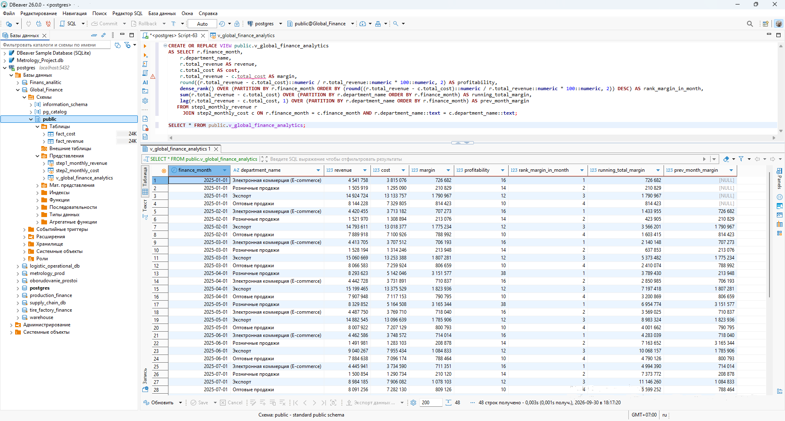
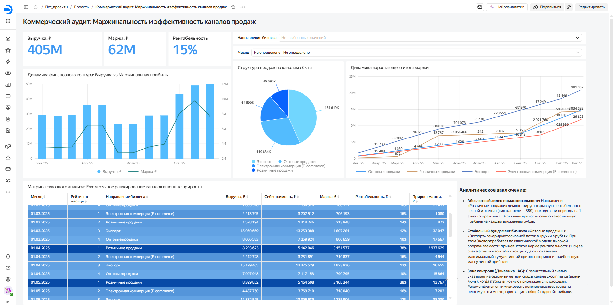

# Сквозной BI-проект: Финансовая аналитика, рейтинги и динамика каналов продаж шинного завода

## 📌 Бизнес-контекст и задача
После оптимизации производственных цехов шинного завода перед менеджментом встала задача коммерческого аудита. Компания реализует готовую продукцию по четырем направлениям: **Экспорт**, **Оптовые продажи**, **Электронная коммерция (E-commerce)** и **Розничные продажи**. Данные по выручке и расходам хранились разрозненно, что мешало оперативно оценивать чистую эффективность каналов.

**Цель проекта:** Консолидировать финансовые логи, рассчитать маржинальность и кумулятивный (нарастающий) эффект каждого направления, а также развернуть интерактивную панель управления для генерального директора.

---

## 🛠 Архитектура данных и технический стек

* **СУБД и ETL:** PostgreSQL (среда разработки DBeaver). Реализована многоуровневая архитектура представлений (`Views`) для исключения искажений при объединении фактов доходов и расходов.
* **Аналитический SQL:** Использование оконных функций (`DENSE_RANK`, `LAG`, `SUM OVER`) для расчетов динамических рейтингов, нарастающего итога и цепных приростов на стороне базы данных.
* **Перенос данных:** Экспорт агрегированной витрины в оптимизированный CSV-формат для интеграции с BI.
* **BI-платформа:** Yandex DataLens. Построение интерактивных визуализаций, расчет динамических показателей рентабельности и условное форматирование табличных матриц.

---

## 📐 Логика обработки данных и SQL-витрина

Обработка и подготовка данных в PostgreSQL реализована в 3 последовательных этапа:

1. **Агрегация выручки:** Помесячное схлопывание всех коммерческих поступлений по направлениям.
2. **Агрегация себестоимости:** Помесячная сумма затрат по каждому направлению.
3. **Формирование аналитической витрины:** Объединение показателей выручки и себестоимости с обогащением расчетными метриками:
   * **Маржа:** Вычисление абсолютной чистой прибыли направления.
   * **Рентабельность:** Расчет процентного соотношения маржи к выручке.
   * **Ранжирование (`DENSE_RANK`):** Ежемесячное присвоение мест направлениям на основе их маржинальности.
   * **Нарастающий итог (`SUM OVER`):** Кумулятивное накопление маржи с начала года для оценки масштаба каждого канала.
   * **Сдвиг во времени (`LAG`):** Сравнение показателей текущего месяца с предыдущим для выявления динамики и сезонных трендов.

> Полный SQL-скрипт создания аналитических представлений доступен в файле [`sql/sql_finance_analytics_views.sql`](sql/sql_finance_analytics_views.sql).

### Результат выполнения витрины в DBeaver

---

## 📊 Ключевые бизнес-инсайты дашборда

На основе разработанного дашборда сформированы следующие стратегические выводы для руководства:

1. **Общая картина:** Годовая выручка компании составила **405 млн ₽**, чистая маржа — **62 млн ₽**, а средняя рентабельность бизнеса зафиксировалась на отметке **15%**.
2. **Анализ кумулятивного вклада (Нарастающий итог):** График нарастающей маржи наглядно показал разницу бизнес-моделей. **Розничные продажи** демонстрируют взрывную рентабельность в отдельные периоды (до **38%** в пиковые месяцы), но за счет колоссального эффекта масштаба и объемов оборачиваемости **Экспорт** к концу года становится главным финансовым донором, принося компании наибольшую массу чистой прибыли — **20.9 млн ₽**.
3. **Детекция рисков и сезонности (Логика LAG):** Благодаря внедрению расчета разницы с предыдущим периодом, на комбинированном графике выручки и маржи четко локализован сезонный спад в канале **E-commerce** в летние месяцы (июнь-июль), когда маржа вплотную приближается к костам. Это дает руководство инструмент для своевременной оптимизации маркетинговых бюджетов и защиты годовой прибыли.
